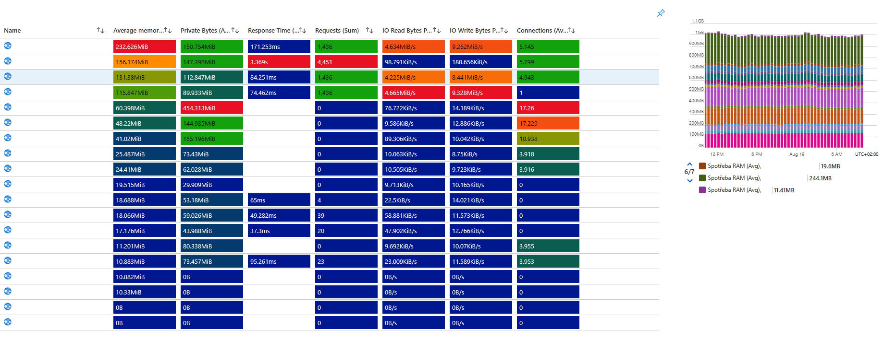

# Infrastructure overview for L1 support

This Azure Workbook is specifically designed to provide an infrastructure overview for helpdesk teams.

## Informations

This workbook contains two parameters, both are required for Workbook to show resources and theirs metrics.

| Parameter  | Required | Type | Information |
| ---------- | -------- | ---- | ----------- |
| Subskripce | X | Subscription Picker | Filter for subscriptions |
| CasoveRozmezi | X | Time range picker | Filter for Time range |

There are two tabs, one for App Services (and App Service Plans) and Databases

The first query contains the name of the App Service Plan along with the basic informations about the plan (including SKU, vRAM and vCPU count, sum of Applications and a column State with Composite bar showing the status based on recommended apps for each SKU.

There are metrics for CPU and Memory usage of the App Services Plan along with Data In and Data Out metrics.

For the App Service Applications itself, the metrics are grouped in a grid layout showing useful metrics in one place.

For the databases, there are two queries - one for the SQL Servers and the other one for the SQL Databases itself.

Then there is a grid layout simmilar to the one for App Service Apps showing metrics for each database.

## Images

Filtering parameters

App Service Plan overview & picker

Metrics of selected App Service Plan

Grid with metrics of Web Apps running on selected plan

Database metrics

